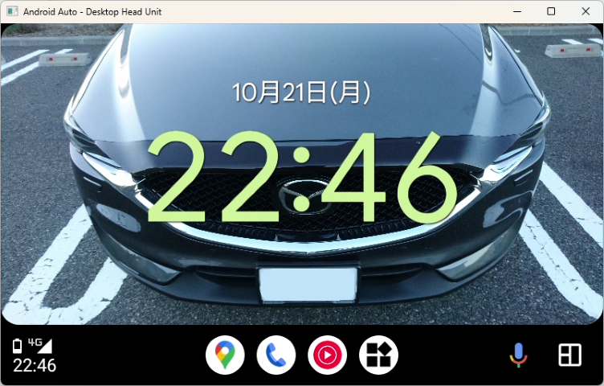

# AAWidget

Android Autoヘッドユニットにウィジェットを表示します。
下図はマツダコネクト(初代)で時計のウィジェットを表示しています。

## 既存アプリ

同様のアプリ([widgets-for-auto](https://github.com/ns130291/widgets-for-auto)
)が既に存在しています。機能の比較は下表のとおりです。

|     | AAWidget | widgets-for-auto |
| --- | ---      | ---              |
| ウィジェットをカーナビゲーションアプリと別に表示 | 可能 | 可能 |
| ウィジェットをカーナビゲーションアプリの領域に表示 | 可能 | 不可 |
| ウィジェットのタップ操作 | 不可 | 可能 |
| アシスタントからナビゲーション開始 | 可能 ウィジェットをカーナビゲーションアプリの領域に表示した場合は制約あり(制約事項を参照) | 可能 |
| 背景色の設定 | 可能 | 不可 |
| 壁紙の設定 | 可能 | 不可 |
| Android Auto SDK | 公式SDK(設計ポリシーには非準拠) | 非公式SDK |

## 必要アプリ・機器と動作確認
1. Android 9 (API Level 28)以上の端末
    1. Android 15の端末で動作確認しています。
1. [AAWireless](https://www.aawireless.io/)
    1. Android 14以降のAndroid Autoで非認証アプリを動作させるためにAAWirelessを用いています。
    1. Android 13以前であればKingInstallerなどを用いればAAWirelessなしでも動作するかもしれませんが未確認です。
1. [Android Autoアプリ](https://play.google.com/store/apps/details?id=com.google.android.projection.gearhead)
1. Android Autoヘッドユニット (Android Auto対応ナビなど)

## インストール
本アプリはAndroid Autoのポリシーに準拠していないため、Google Playストアから配布できません。そのため、以下の手順に従ってインストールしてください。
1. [リリースページ](https://gitlab.com/sckzw/aawidget/-/releases)からAPKファイルをダウンロードし、端末にアプリをインストールしてください。
1. Android Autoの設定画面の一番下の「バージョン」をタップして「バージョンと権限情報」を表示します。
1. 「バージョンと権限情報」を10回タップします。
1. 「デベロッパー向けの設定を有効にしますか?」ダイアログが表示されるので、「OK」をタップします。これでデベロッパーモードが有効になります。
1. Android Autoの設定画面の右上のメニューから「デベロッパー向けの設定」をタップします。
1. 「デベロッパー向けの設定」画面の下の方の「提供元不明のアプリ」をチェックします。

## AAWidget設定
1. 端末上でAAWidgetを起動してください。
1. メイン画面の「背景色コード」にウィジェットの背景に表示したい色コードを設定してください。
    1. 色コードの書式は#RRGGBBで設定してください(例: 赤色の場合は#FF0000)。
1. メイン画面の「壁紙を追加」をタップしてウィジェットの背景に表示したい画像ファイルを選択してください。
    1. 壁紙を追加した場合は背景色は表示されません。
1. メイン画面の「ウィジェットを追加する」をタップしてください。
    1. ウィジェットのプレビューがリストアップされるので、その中から追加したいウィジェットを選択してタップしてください。
    1. 「ウィジェットの作成とアクセスの許可」の画面が表示されるので、「作成」をタップしてください。
    1. ウィジェットによっては設定画面が表示される場合があるので、画面の表示に従って設定してください。
1. メイン画面にウィジェットが表示されます。

## 使用方法
1. AAWirelessを用いてAndroid Autoヘッドユニットに接続してください。
1. AAWirelessのアプリで「開発者向けの設定」を有効にしてください。
1. Android Autoのホーム画面の「Widget 1」または「Widget 2」のアイコンをタップしてください。
    1. 「Widget 1」をタップするとカーナビゲーションアプリの領域に表示します。
    1. 「Widget 2」をタップするとカーナビゲーションアプリとは別に表示します。
1. Android Autoの画面にウィジェットが表示されます。
1. 端末上のAAWidgetアプリは常に表示しておく必要はありません。

## 注意事項
1. 国内の法律を遵守してアプリを使用してください。
1. 日本国内においては道路交通法の第七十一条の五の五に規定があるとおり、運転中はウィジェットを注視しないでください。

## 制約事項
1. Android Autoに表示されたウィジェットをタップしたり操作することはできません。
1. ウィジェットをカーナビゲーションアプリの領域に表示した場合、Googleアシスタントからナビゲーションを開始することができません。Googleマップなどのアプリに切り替えてからナビゲーションを開始してください。
    1. Android AutoでGoogleアシスタントからナビゲーションを開始しようとすると、最後に表示したナビゲーションアプリでナビゲーションを実行しようとします。
    1. ウィジェットをカーナビゲーションアプリの領域に表示した場合、Googleアシスタントは本アプリでナビゲーションを実行しようとしますが、本アプリにはナビゲーション機能を備えていないため何も実行しません。
1. Android Autoの画面の画素数が少ない場合は、ウィジェットの表示が縮小されて期待した表示にならない場合があります。
1. 一部のウィジェットは正常に動作しません。すべてのウィジェットの動作は確認できません。

## サンプル画像

