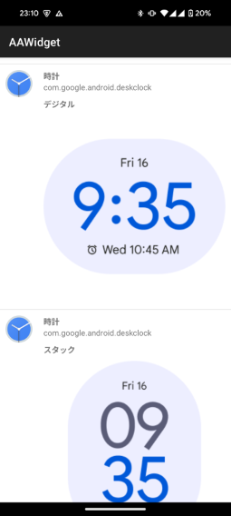

# AAWidget

Android Autoヘッドユニットにウィジェットを表示します。

## 必要アプリ・機器
- Android 9.0 (API Level 28)以上の端末
- [Android Autoアプリ](https://play.google.com/store/apps/details?id=com.google.android.projection.gearhead)
- Android Autoヘッドユニット (Android Auto対応ナビなど)
- [AAWireless](https://www.aawireless.io/)

## インストール
本アプリはAndroid Autoのポリシーに準拠していないため、Google Playストアから配布できません。したがって、以下の手順に従ってインストールしてください。
1. [リリースページ](https://gitlab.com/sckzw/aawidget/-/releases)からAPKファイルをダウンロードし、端末にアプリをインストールしてください。
1. Android Autoの設定画面の一番下の「バージョン」をタップして「バージョンと権限情報」を表示します。
1. 「バージョンと権限情報」を10回タップします。
1. 「デベロッパー向けの設定を有効にしますか?」ダイアログが表示されるので、「OK」をタップします。これでデベロッパーモードが有効になります。
1. Android Autoの設定画面の右上のメニューから「デベロッパー向けの設定」をタップします。
1. 「デベロッパー向けの設定」画面の下の方の「提供元不明のアプリ」をチェックします。

## 設定
1. AAWidgetのメイン画面の「背景色コード」にウィジェットの背景に表示したい色コードを設定してください。色コードの書式は#RRGGBBで設定してください(例: 赤色の場合は#FF0000)。
1. AAWidgetのメイン画面の「ウィジェットを追加する」をタップしてください。
    1. ウィジェットのプレビューがリストアップされるので、その中から追加したいウィジェットを選択してタップしてください。
    1. 「ウィジェットの作成とアクセスの許可」の画面が表示されるので、「作成」をタップしてください。
    1. ウィジェットによっては設定画面が表示される場合があるので、画面の表示に従って設定してください。
1. メイン画面にウィジェットが表示されます。
1. ウィジェットを変更したい場合は、「ウィジェットを削除する」をタップした後、再度「ウィジェットを追加する」をタップしてください。

## 使用方法
1. AAWirelessを用いてAndroid Autoヘッドユニットに接続してください。
1. AAWirelessのアプリで「開発者向けの設定」を有効にしてください。
1. Android Autoのホーム画面の「AAWidget」のアイコンをタップしてください。
1. Android Autoの画面にウィジェットが表示されます。
1. AAWidgetは常に表示しておく必要はないため画面を閉じてください。

## 注意事項
1. 国内の法律を遵守してください。
1. 日本国内においては道路交通法の第七十一条の五の五に規定があるとおり、運転中はウィジェットを注視しないでください。

## 制約事項
1. Android Autoに表示されたウィジェットをタップしたり操作することはできません。
1. Android Autoにウィジェットを表示している間はGoogleアシスタントからナビゲーションを開始することができません。Googleマップなどのアプリに切り替えてからナビゲーションを開始してください。
    1. Android AutoでGoogleアシスタントからナビゲーションを開始しようとすると、最後に表示したナビゲーションアプリでナビゲーションを実行しようとします。
    1. 本アプリはカーナビゲーションアプリ扱いであるため、本アプリでナビゲーションを実行しようとしますが、本アプリにはナビゲーション機能を備えていないため何も実行しません。
1. Android Autoの画面は画素数が少ない場合は、ウィジェットの表示が縮小されて期待した表示にならない場合があります。
1. 一部のウィジェットは正常に動作しません。

## サンプル画像

